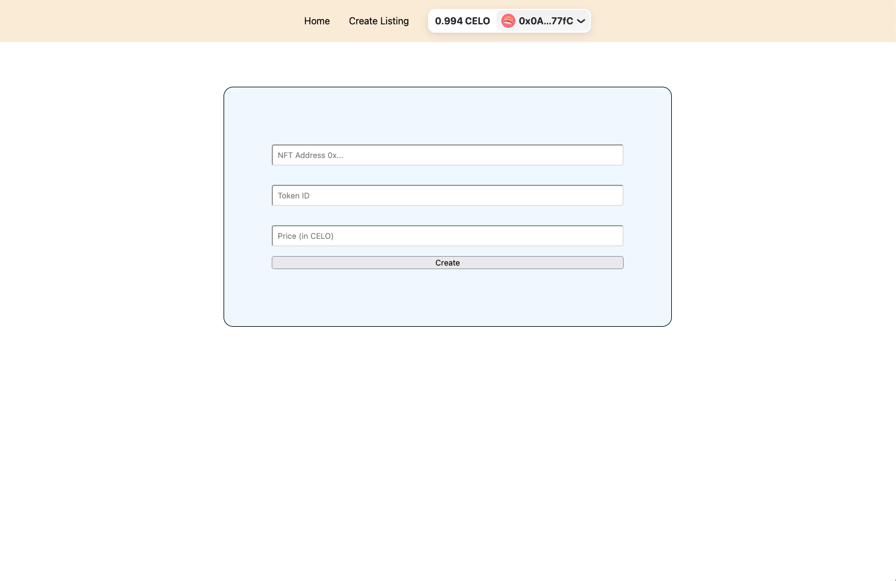

# NFT - dApp

<figure><figcaption></figcaption></figure>

Finally it's time to build the part of our project folks can interact with!

Smart Contracts ✅ Deployment Scripts ✅ Subgraph ✅ Frontend ☑️

It's time to build our frontend now. As always, we will be using [Next.js](https://nextjs.org/) to do so.

### Website Development

#### 👨‍🔬 Setting Up

1.  Open up your terminal, and enter the `celo-nft-marketplace` directory

    ```
    cd celo-nft-marketplace
    ```
2.  Initialize a new Next.js app by running the following command

    ```
    npx create-next-app@latest frontend
    ```

We now have a fresh new Next.js project ready to go!

#### 😎 Git Good

The `create-next-app` tool also initializes a Git repo when it sets up the project. However, since our parent directory `celo-nft-marketplace` is already a Git repo, we don't want to keep the `frontend` folder as a separate Git repo to avoid having one Git repo inside another Git repo (Git submodules).

Run the following command in your terminal

```
# Linux / macOScd 
frontend
rm -rf .git

# Windowscd 
frontend
rmdir /s /q .git
```

#### 🥅 The Goal

By the end, we want to have a few different sections of our app.

1. Homepage - View all listings
2. NFT Details - View a specific listing, allow updating/canceling listing if owner
3. Create Listing - Add a new listing

The way it will work is as follows:

The homepage will retrieve data from our subgraph, to display all currently active listings and their prices.

Clicking on a listing from the homepage will bring us to the NFT details page, where users will have the option to buy the NFT. If they are the seller, they will have the option to update the price or cancel the listing.

There will be a separate Create Listing page where users can enter the NFT Contract Address and Token ID of the NFT they want to sell, and a new listing will be created.

#### ⛩ File Structure

The `pages` directory within the `frontend` folder is where we will be doing most of our work. Right now, the `pages` directory should look something like this

```
pages/
├─ api/
│  ├─ hello.js
├─ _app.js
├─ index.js
```

We won't be doing any backend here, so we can get rid of the `api` folder. So go ahead and delete that.

`index.js` is our homepage, and we will use that to display all listings.

Apart from that, create a new file `create.js` under `pages`, which will be the Create Listing page.

Then, create a new directory called `[nftContract]`, and within it, a file called `[tokenId].js`. This will be a dynamic route, used to show a specific listing.

Now, we will also be creating some React components to increase reusability across pages, so we don't write the same code multiple times.

Create a directory named `components` under `frontend`, and we will add some components here as we go.

By the end, you should have a structure that looks like this:

```
components/pages/
├─ [nftContract]/
│  ├─ [tokenId].js
├─ _app.js
├─ create.js
├─ index.js
```

#### 💰 Initializing Wallet Connection

We will use [RainbowKit](https://www.rainbowkit.com/) and [Wagmi](https://wagmi.sh/) to simplify wallet connection for our dApp.

Install the required dependencies for RainbowKit to get started. Run the following in your terminal, while pointing to the `frontend` directory

> Note : We install v5 specifically since the new v6 has breaking changes to the code.

```
npm install @rainbow-me/rainbowkit wagmi ethers@5
```

We are all familiar with what `ethers` is. `RainbowKit` is a React component library which makes it easy to connect to wallets. Under the hood, it uses `wagmi`, which is a React hooks library to interact with contracts and wallets.

To get RainbowKit to work across your entire app, we need to make some changes to `_app.js`. This is a one-time setup, and will make wallet connection available throughout the rest of our app with ease.

Open up `_app.js` and add the following

```javascript
import "@rainbow-me/rainbowkit/styles.css";
import "../styles/globals.css";

import { getDefaultWallets, RainbowKitProvider } from "@rainbow-me/rainbowkit";
import { configureChains, createClient, WagmiConfig } from "wagmi";
import { jsonRpcProvider } from "wagmi/providers/jsonRpc";

const celoChain = {
  id: 44787,
  name: "Celo Alfajores Testnet",
  network: "alfajores",
  nativeCurrency: {
    decimals: 18,
    name: "Celo",
    symbol: "CELO",
  },
  rpcUrls: {
    default: "https://alfajores-forno.celo-testnet.org",
  },
  blockExplorers: {
    default: {
      name: "CeloScan",
      url: "https://alfajores.celoscan.io",
    },
  },
  testnet: true,
};

const { chains, provider } = configureChains(
  [celoChain],
  [
    jsonRpcProvider({
      rpc: (chain) => {
        if (chain.id !== celoChain.id) return null;
        return { http: chain.rpcUrls.default };
      },
    }),
  ]
);

const { connectors } = getDefaultWallets({
  appName: "Celo NFT Marketplace",
  chains,
});

const wagmiClient = createClient({
  autoConnect: true,
  connectors,
  provider,
});

// export default function App({ Component, pageProps }) {
//   return <Component {...pageProps} />
// }

function MyApp({ Component, pageProps }) {
  return (
    <WagmiConfig client={wagmiClient}>
      <RainbowKitProvider chains={chains}>
        <Component {...pageProps} />
      </RainbowKitProvider>
    </WagmiConfig>
  );
}
```

This code may seem a bit convoluted at first, but most of this is taken directly from [RainbowKit documentation](https://www.rainbowkit.com/docs/installation). All we are doing is configuring Wagmi and RainbowKit, telling it what chains we want our dApp to support, configuring the chain object, and then wrapping our entire app with the Wagmi and RainbowKit providers so it has access to this data throughout the app.

#### ✍️ ABIs

To interact with our contracts, we need the ABIs. In our case, we need an ABI for ERC721 contract. Luckily, Wagmi provides us with an [ABI](https://wagmi.sh/docs/constants/abis) we can use.

Create an `abis` folder under `frontend`, and create one files there - `NFTMarketplace.json`.

Copy over the **ABI** from the `hardhat/artifacts/contracts/NFTMarketplace.sol/NFTMarketplace.json` into `NFTMarketplace.json`. Make sure you copied only the ABI(which includes just the array \[] portion including the square brackets) portion and not the whole file.

#### 🗺 Navbar Component

At the top of every page should be a navigation bar to let users switch between pages. It will also contain the RainbowKit button to connect wallets. We will build a simple Navbar component for this.

Create a file `Navbar.js` under `components`, and write the following code there:


